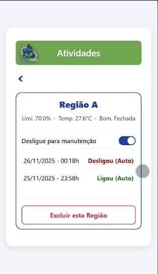
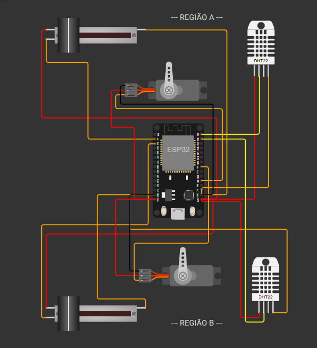

# 🌱 AgroFlow - Sistema de Irrigação Inteligente

Sistema IoT completo para monitoramento e automação de irrigação, desenvolvido para auxiliar agricultores no controle de umidade e temperatura do solo.

## 📸 Telas do Sistema

### Painel Principal
Visão geral de todas as regiões monitoradas em tempo real.

### Detalhes e Histórico
Controle manual da bomba e histórico de atividades da região.

### Simulação IoT (Wokwi)
Circuito com ESP32, sensores DHT22 e relés para as bombas.

## 🚀 Tecnologias Utilizadas

### Backend

### Frontend

### IoT & Hardware

---

## ⚙️ Funcionalidades

* [x] Monitoramento em tempo real de Umidade e Temperatura.
* [x] Controle automático da bomba de água baseado na umidade.
* [x] Controle manual (Remoto) via Web para ligar/desligar ou entrar em modo Manutenção.
* [x] Histórico de atividades e acionamentos.
* [x] Sistema de Login e Cadastro de Usuários.

## 🛠️ Como rodar o projeto

### Pré-requisitos
* Java JDK 17+
* PostgreSQL
* Wokwi (Simulador Web)

### Passos
1.  Clone o repositório.
2.  Configure o `application.properties` com seu banco de dados local.
3.  Inicie o Backend Java.
4.  Abra o arquivo `index.html` no navegador (via Live Server).
5.  Para acesso externo (celular/IoT), utilize o `localtunnel` nas portas 8080 e 5500.

---
Desenvolvido por **Nadson Klaus**.
